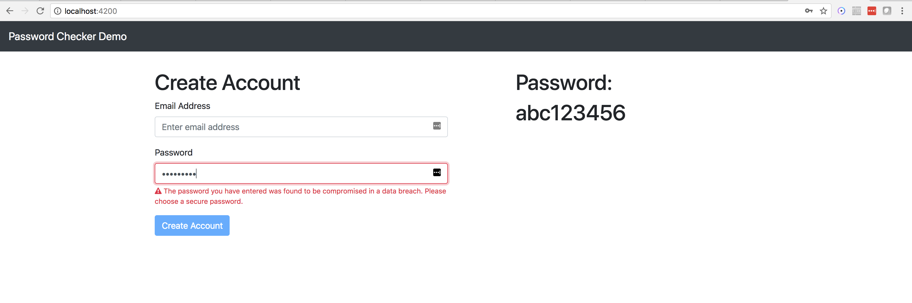

# Password Checker Service

This service checks password hashes against known data breaches. It can be used during
account creation to protect users from setting their login password to breached passwords.




## Set up

You must download breached password data set from Pwned Password list at 
https://haveibeenpwned.com/Passwords

Date: 22 Feb 2018
URL: https://downloads.pwnedpasswords.com/passwords/pwned-passwords-2.0.txt.7z.torrent 
SHA-1: c267424e7d2bb5b10adff4d776fa14b0967bf0cc

The data file should be placed a data folder configured in application.yml to be imported
when the application starts up.


### Database

```shell
docker run -d -p 51337:5432 \
--name password_check_postgresql \
-e POSTGRES_PASSWORD=12345 \
-e POSTGRES_USER=postgres \
-e POSTGRES_DB=password_check \
postgres:9.6.1
```

### Run Service

```
mvn spring-boot:run
```

### Run Demo App

```
cd demo
ng serve
```


## Example Request

```
curl http://localhost:1337 -X POST \
-H 'Content-type: application/json' \
-d '{
    "password": "12345"
}'
```

```
{
    "compromised": true
}
```
